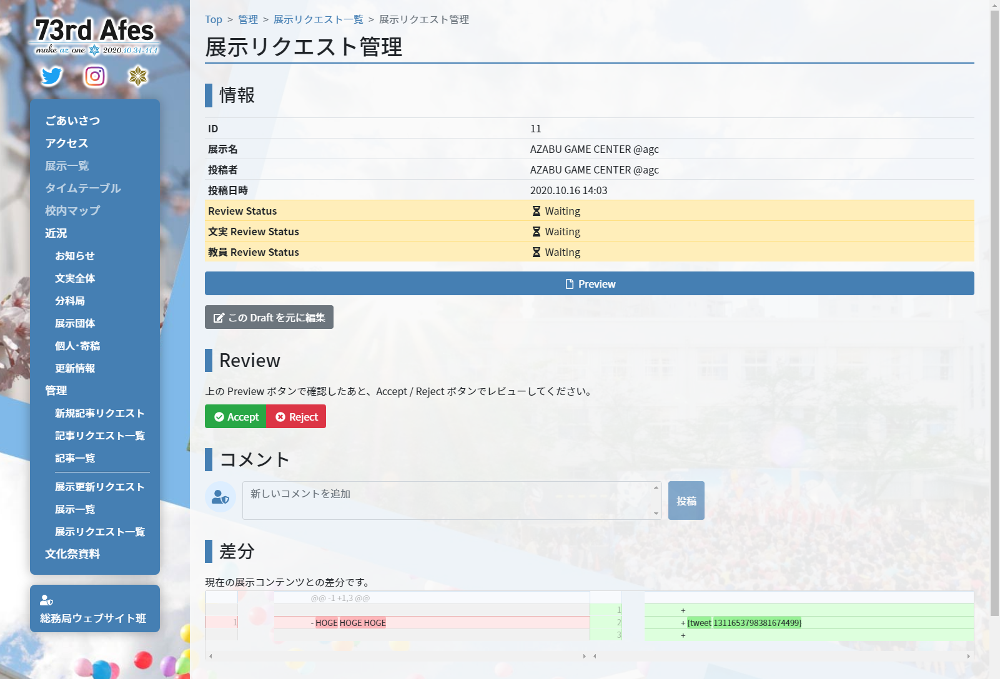

# 1. 管理ページ一覧

文化祭ウェブサイト上にはたくさんの管理ページがあります。  
このページでは、オンライン展示関連に絞って管理ページを紹介します。

## 展示一覧

オンライン展示出展団体のリストです。

- Manage : 展示団体の管理画面を開きます [→ 展示管理](#展示管理)

## 展示管理

展示団体の情報やサムネイル画像、その展示の draft 一覧を見ることができます。

- 編集 : 今の展示内容を編集して新規 draft を作成します [→ 展示更新リクエスト](#展示更新リクエスト)
- [2. レビューする](2-review)

## 更新リクエスト一覧

すべての展示からの draft 一覧です。実際には展示単位で確認することのほうが多いと思います。

- [2. レビューする](2-review)

## 更新リクエスト管理

展示更新リクエストの情報確認やプレビュー、レビューやコメントの追加ができます。

- [2. レビューする](2-review)

---

| 前のページ | | 次のページ |
| :-: | :-: | :-: |
| - | **[管理者向け目次](.)** | **[2.レビューする >](2-review)** |
