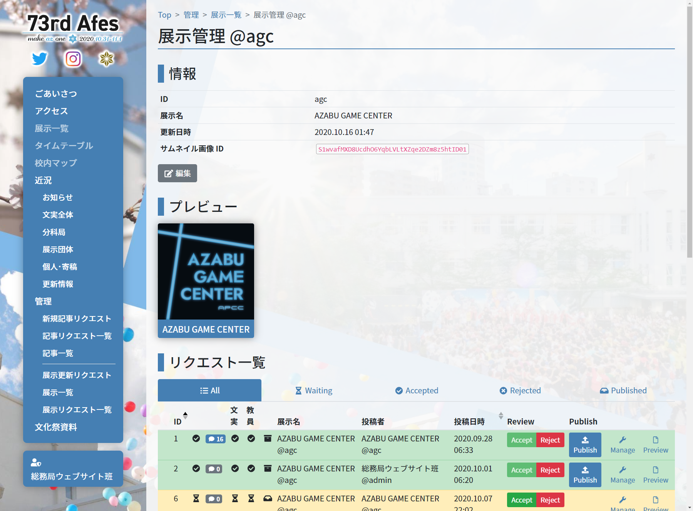
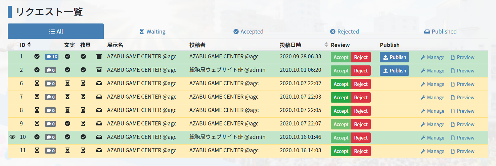
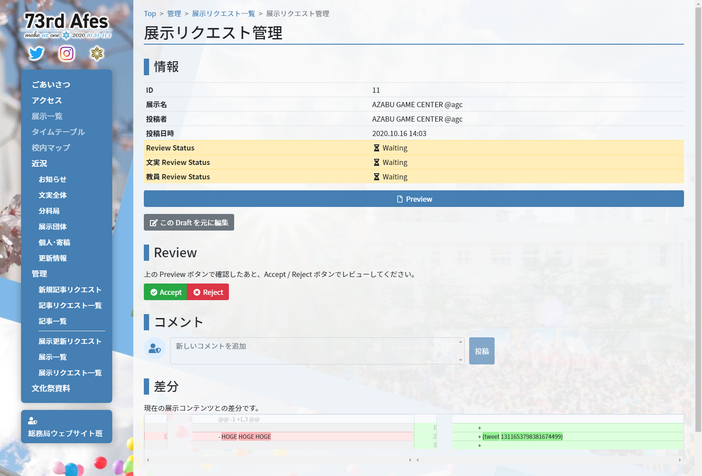

# レビューする

## レビューとは

全ての draft は、必ず「レビュー」を経て公開されます。  
このページをご覧の文実・教員の方々は、各展示が作成した draft の内容を精査し、Accept / Reject してください。

文実・教員双方ともに Accept した場合にのみ、その draft が公開されます。公開作業は文実側で行います。

このページでは、AZABU GAME CENTER 展 (@agc) を例として扱います。実際のレビュー依頼元の展示に置き換えて読み進めてください。

## 展示管理画面を開く

展示から draft のレビュー依頼が来たら、まず当該展示の管理ページを開きます。

[アカウントについて - ログイン](/common/account#ログイン) の通りにログインし、「展示一覧」を開き、当該展示の「Manage」リンクを押すと、下画像のような画面が出ます。  
各展示の管理はこの画面から行うので、展示顧問の方々は頭の片隅に留めておいてください。

### 関連リンク

- [アカウントについて](/common/account)

## レビューする draft を探す

スクロールすると、「リクエスト一覧」というタイトルとカラフルなリストがあります。

＊教員アカウントの場合、Publish ボタンは表示されません。

特に展示側から指定がないのであれば、最新の draft でよいでしょう。この例では一番下の 11 番が最新の draft です。

さらっと「11 番」という番号がでてきました。この番号は、全ての draft に付いている通し番号で、1 から順番に割り当てられていきます。

展示側から番号を指定してのレビュー依頼があった場合は、当てはまる draft を探してください。

## 中身の確認をする

レビューする draft が見つかったら、その中身を確認しましょう。

行の右側にある「Manage」で draft の管理画面が開きます。

一番上には draft の情報があり、次にプレビューボタンとレビューボタンがあります。

「Preview」で実際にその draft のプレビューが開きます。内容に問題がないかを確認してください。

また、draft に対してコメントをつけることもできます。これは内部用であり、外部には公開されません。  
レビューしていてわからないところがあった場合にメモを残すなど、様々な使いみちがあるかと思います。

「差分」は、現在公開中の展示内容との差分が表示されます。  
何が変わったのか、をひと目で見るのにご活用ください。

## いざレビュー

中身に問題がなければ「Accept」、問題があるようでしたら「Reject」を押してください。

Reject する場合は理由をコメントしておくとお互いに楽でしょう。
