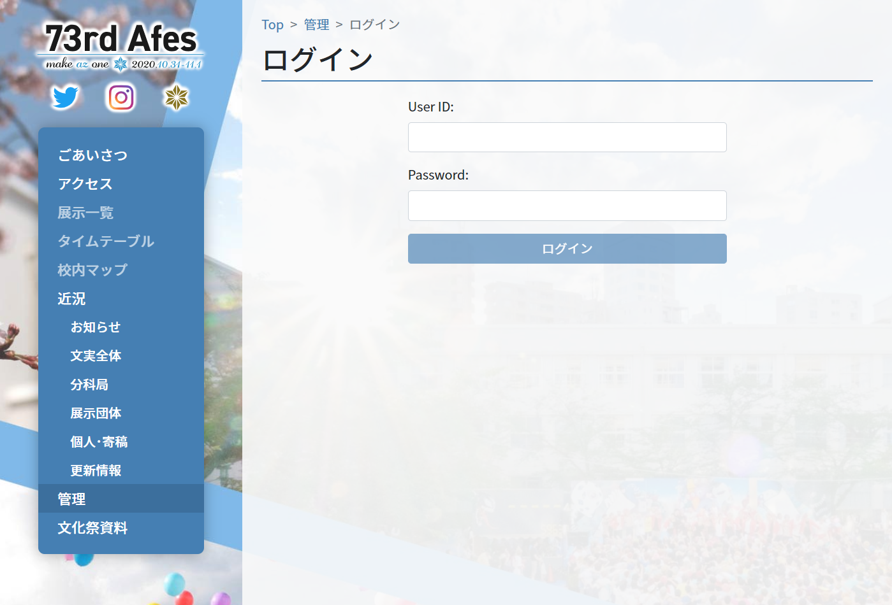
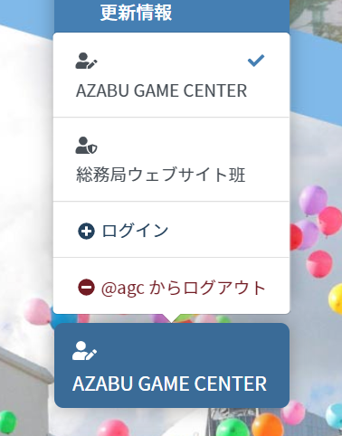
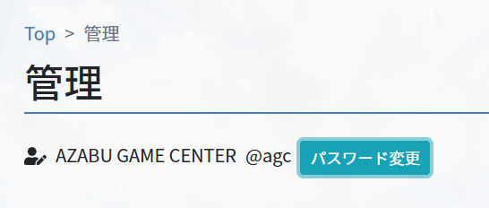

# アカウントについて

## アカウント配布

### 一般展示

基本的にアカウントは以前配布したものをお使いください。

一部展示団体は展示 ID の変更に合わせてユーザー ID も変更になります。変更の案内は展責グループで行いますので、アナウンスをお待ちください。

### フロンティア展示・ステージ展示

新しく配布します。配布方法は未定ですが、おそらく各展責との個人 LINE で、ID と初期パスワードを配布する予定です。アナウンスをお待ち下さい。

### 文実内部 管理者

該当者に直接 ID とパスワードを配布します。

### 各展示顧問の方々

教員共通で１つのアカウントを配布する予定です。

## ログイン

トップページ左側のリストから「管理」ボタンを押すとログイン画面が出ます。また、２つ目以降は左下のユーザーメニューからログインしてください。

## アカウント切り替え

ログイン後、トップページ左下に現在ログインしているアカウントが表示されるようになります。

展示を掛け持ちしている場合など、複数のアカウントでログインしたい場合はここから新しいアカウントでログインする事ができます。また、アカウントを切り替える事も可能です。

複数ログインする場合、ログインしているアカウントに注意してください。

## ログアウト

アカウント切り替えと同様に、左下ユーザーメニューからログアウトできます。

## パスワード変更

ログイン後、「管理」ページからパスワードを変更できます。

---

| 前のページ | 目次 | 次のページ |
| :-: | :-: | :-: |
| **[< 公開までの流れ ](./operation)**  | **[全体](/)** | - |
| - | **[展示団体向け](/exhibition)** | **[1. 展示更新リクエスト >](/exhibition/1-post)** |
| - | **[管理者向け](/admin)** | **[1. 管理画面 >](/admin/1-manage)** |
