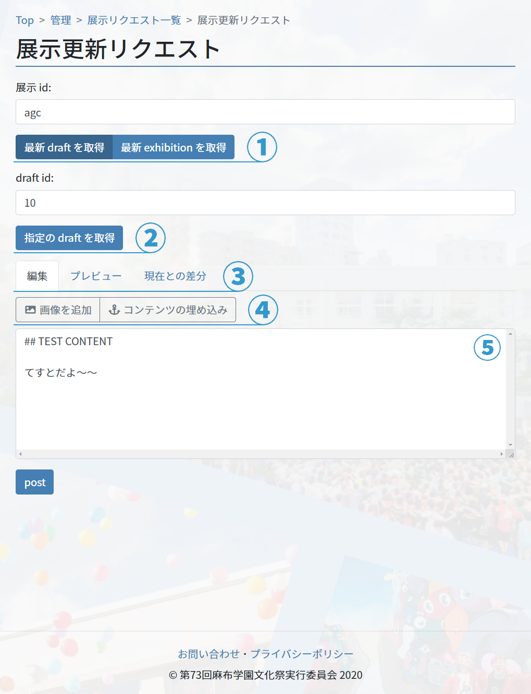

# 1. 展示更新リクエスト

展示更新リクエストは各展示が行えます。ここではリクエストを投稿する画面の説明をします。

## 編集

本文の記法には Markdown を採用しています。
Markdown についての詳細は [2. マークアップ](./2-markup) をご覧ください。

編集・作成する際のエディターは、文化祭ウェブサイト以外を使用する事をおすすめします。  
特にこだわりがない場合は、 [HackMD](https://hackmd.io) をおすすめします。会員登録が必要にはなりますが、設定をする事で共同編集ができ、また自動保存で、更に Markdown が分からなくても十分扱いやすいようになっています。  
他にも、"Markdown エディタ" で検索すると色々出てきます。

ただし、"文化祭ウェブサイトでは対応していないけど、そのエディタなら対応している" という要素・機能があるかもしれません。  
できる事・できない事のリストは全て [2. マークアップ](./2-markup) に記載しているのでご確認ください。  
また、投稿画面に貼り付けた後、必ず **プレビュー** 画面をチェックして、**ちゃんと表示されているかを確認**してください。

また、通常の Markdown にはない、 リンクの埋め込み機能があります。他のエディタ上ではできない事ですので、これについてはリンクやどんな画像を貼るかだけをエディタでメモし、投稿前に [3. 画像と埋め込み](./3-image-url) を確認しながら編集してください。

投稿後には顧問への連絡などを行う必要があります。必ず [4. 投稿後にやること](./4-after-post) を確認してください。

## 投稿画面

1. **最新 draft / exhibition 取得ボタン**：  
  ＊展示団体向けアカウントでは展示 id を指定することはできません。  
  - 最新 draft を取得 : 該当展示の draft で最新のものが編集フィールドに表示されます。  
  - 最新 exhibition を取得 : 現在公開されているものが編集フィールドに表示されます。  
2. **指定 draft 取得ボタン**：  
  draft の番号を指定する事もできます。  
  draft id は全展示の draft に対して通し番号で振っているので、1番を指定しても自分が最初に投稿した draft が表示されるとは限りません。  
  また、展示団体向けアカウントでは、自展示以外の draft は取得できません。
3. **編集 / プレビュー / 現在との差分ボタン**：  
  編集タブで本文の編集などが行えます。  
  プレビュータブは、編集してる最中のものがそのまま公開された時のプレビューが表示されます。  
  現在との差分タブでは、①②で取得した結果との差分が表示されています。
4. **画像・コンテンツの埋め込みボタン**：  
  画像をアップロードしたり、ツイートや YouTube の埋め込みができます。  
  詳細は [3. 画像と埋め込み](./3-image-url) を参照してください。  
5. **編集フィールド**：  
  本文のテキストフィールドです。  
  ここの書き方は [2. マークアップ](./2-markup) を参照してください。

## 投稿前の確認事項

- [ ] プレビューを確認して、誤字脱字や見た目に問題がないか
  - [ ] リンクはすべて正しいか
  - [ ] 改行したいところを改行しているか (スペース 2 つ！)
  - [ ] 各見出しは `#` 2 つ以上で始まっているか ( `#` 1 つはタイトルになるので使わない！)
- [ ] コンテンツが文化祭の展示についてのものになっているか
- [ ] 投稿後にやることを確認したか → [4. 投稿後にやること](./4-after-post)

----

| 前のページ | | 次のページ |
| :-: | :-: | :-: |
| **[アカウントについて](/common/account)** | **[目次](.)** | **[2. マークアップ >](./2-markup)** |
