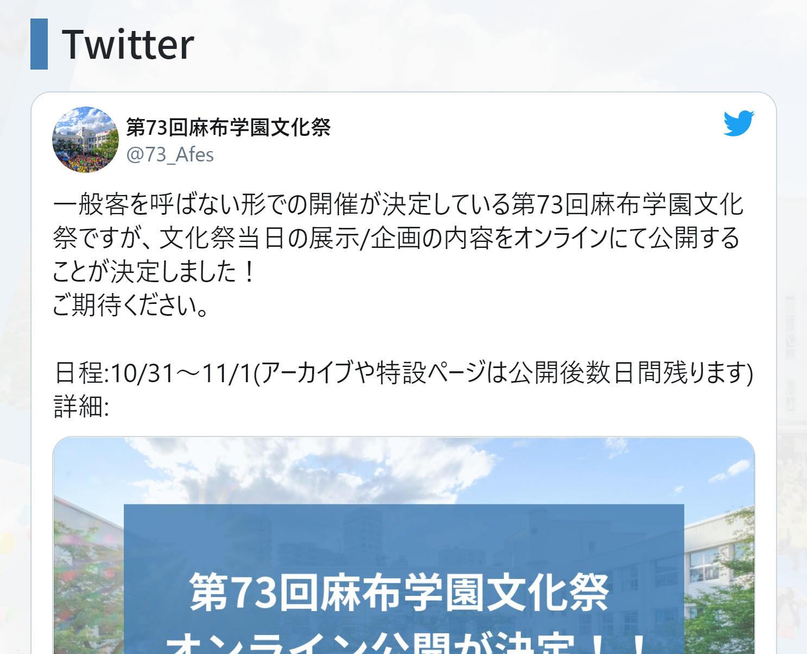
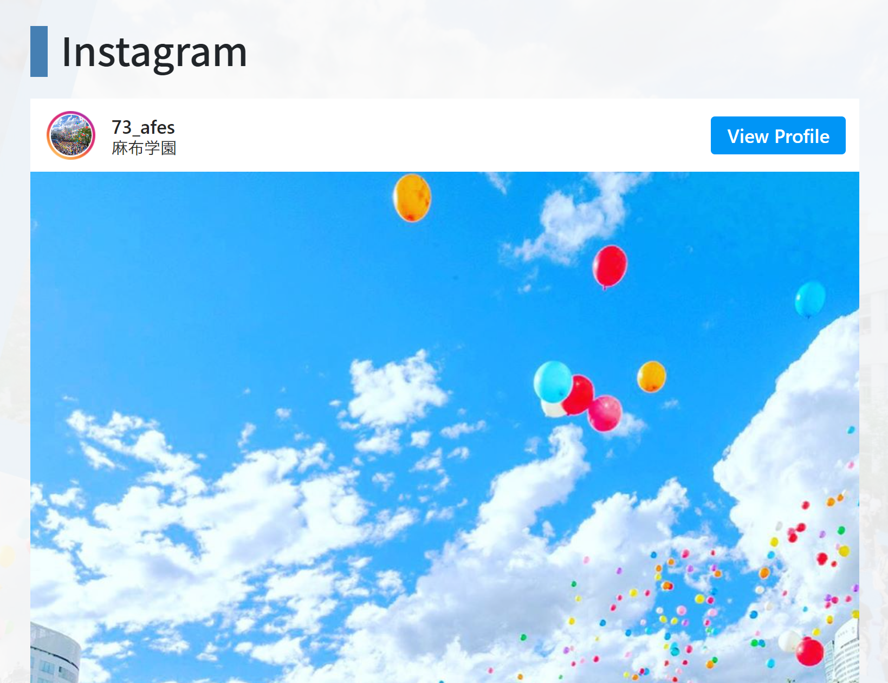
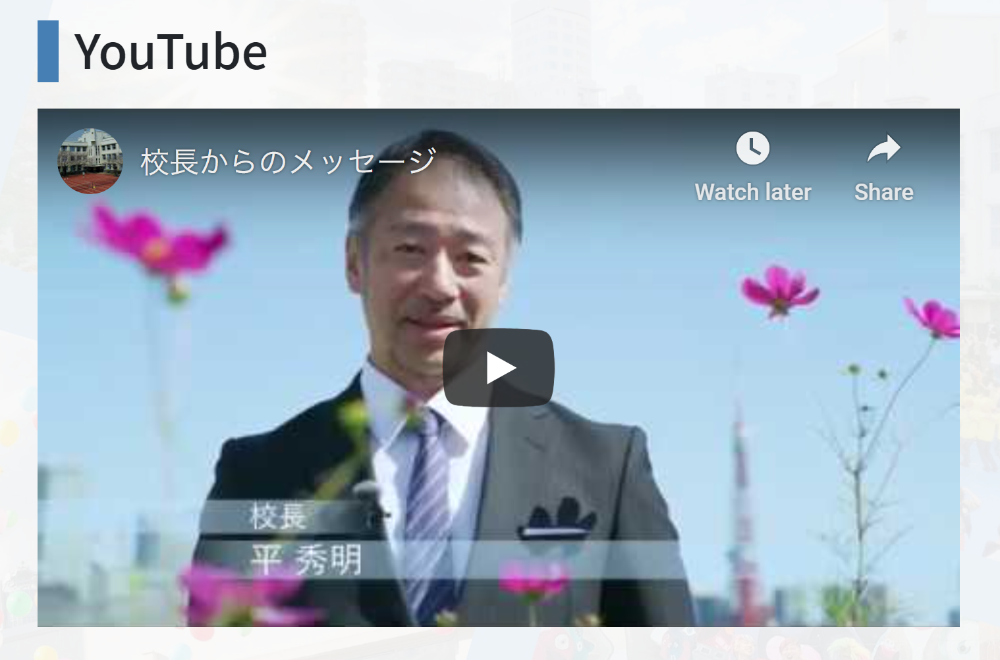

# 3. 画像と埋め込み

## 画像の埋め込み

画像は、下のような形式で埋め込むことができます。

```md

```

また、編集フィールドの上の「画像を追加」から画像をアップロードすることで、文化祭ウェブサイトに画像を上げることもできます。

アップロードされた画像は、フィールドの末尾に追加されます。`` の形式のまま動かしてお使いください。

## Twitter, Instagram, YouTube の埋め込み

各種 SNS は、以下の形式で埋め込むことができます。

```md
{twitter <tweet id>}
{instagram <post id>}
{youtube <video id>}
```

また、編集フィールドの上の「コンテンツの挿入」を開き、各種共有 URL を貼ることで埋め込みコードを生成できます。

「挿入」を押すと、フィールドの末尾に追加されます。`{hoge id}` の形式のまま動かしてお使いください。

| Twitter | Instagram | YouTube |
| :-: | :-: | :-: |
|  |  |  |

---

| 前のページ | | 次のページ |
| :-: | :-: | :-: |
| **[< 2. マークアップ](./2-markup)** | **[目次](.)** | **[4. 投稿後にやること >](./4-after-post)** |
